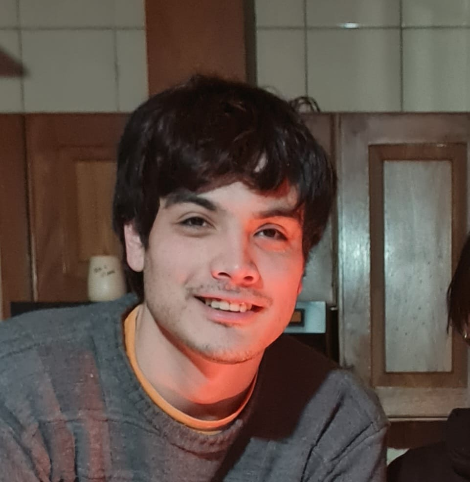

Bienvenidos a
# Programación con objetos I

En esta materia aprenderán sobre la famosa POO _(OOP en inglés)_, un paradigma que propone como base **objetos** que tienen un **estado** y **comportamiento**.
Para ello usaremos como herramienta el lenguaje Wollok.

```wollok
object programacionConObjetos { 
    method saludar() { 
        return  "Bienvenidxs!" 
    }
}
```

## Links importantes :monocle_face:
- [x] [Página principal](https://obj1-unahur.github.io/) de la materia (no olviden entrar seguido!) 
- [x] [Cronograma](https://docs.google.com/spreadsheets/d/1Ik6coqFm2lr2m6EFBGo3Ul4Bi4RPhrrtMQLbK3WcbIQ/edit?usp=sharing) de clases.
- [x] [Matricularse](https://discord.gg/tqyHtPt) y ver el canal de Discord.
- [x] [Mumuki](https://mumuki.io/unahur-obj1)

### Referencias Markdown 
* [Wikipedia](https://es.wikipedia.org/wiki/Markdown)
* [Guía Rápida](https://greg.schueler.us/doc/markdown.txt) de la sintaxis _(en inglés)_
* [Emojis!](https://github.com/ikatyang/emoji-cheat-sheet/blob/master/README.md) :sunglasses:

### Presentacion Personal

Me llamo ...

Me gusta ...

Me dedico a / Trabajo de ...

Les dejo una imagen mía 


# Iván Herold
Me llamo Iván Herold, tengo 29 años y soy de Hurlingham. He hecho otra carrera, pero siempre me quedo la pica de la parte infórmatica por eso decidí que sea ahora o nunca. Actualmente estoy a 2 materias de terminar primer año.

TAmbién ayudo mucho para que este haciendo esta carrera un amigo, con el cuál pensamos en algún momento poder hacer juegos, y en algún momento publicarlos ¿Por qué no?.

Ya tuve un contacto con objetos desde Mumuki en Argentina Programa, y quede fascinado con la potente herramienta que es, y toodas las cosas que se pueden hacer, por lo cual estoy muy entusiasmado con esta materia.

Me gusta el mundo de las computadoras, últimamente mucho más el hardware. Poder elegir, o pensar por ejemplo las mejores combinaciones en componentes de una PC me resulta entretenido, es todo un desafio hoy en día. Me gusta la ciencia ficción, las buenas historias tanto en películas, libros e inclusive juegos.

Actualmente trabajo en investigación y desarrollo en el INTI, en base a materiales en base a fibra de carbono; en relación a la carrera que estudie previamente. Si bien me gusta y es con lo que vivo actualmente, como mencione antes quiero sacarme la espina de saber más sobre el mundo de la informática.

### Les dejo una imagen mía



